# Memory in EVM

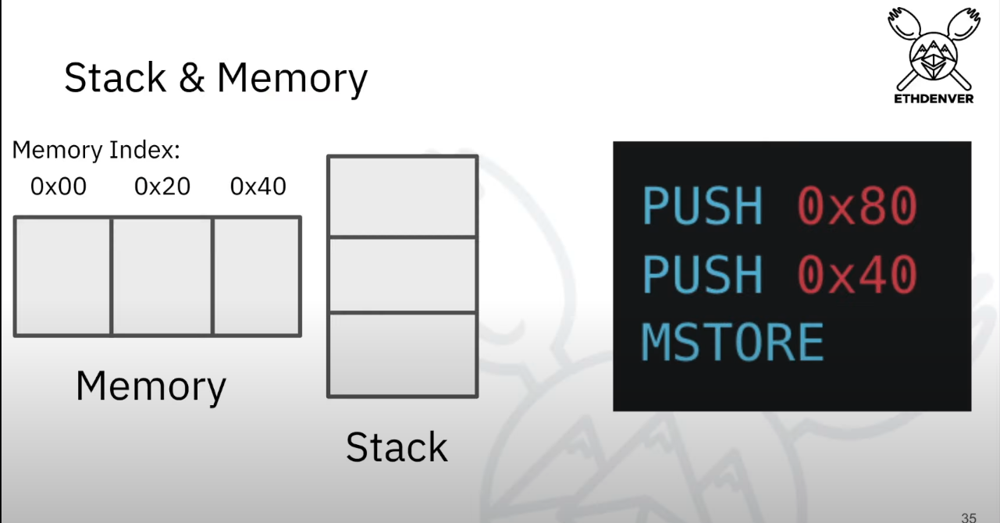

- Memory is a giant array
- Each slot is 32 bytes
- Each memory slot is offset in bytes
- 0th slot -> 0x00
- 1st slot -> 0x20
- 2nd slot -> 0x40

- 0x20 is 32 bytes in hex

----

- PUSH1 0x80              // [0x80]
- PUSH1 0x40              // [0x40, 0x80]  
- MSTORE

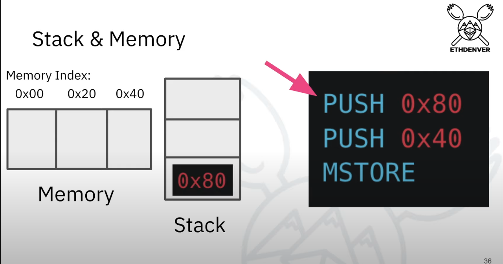
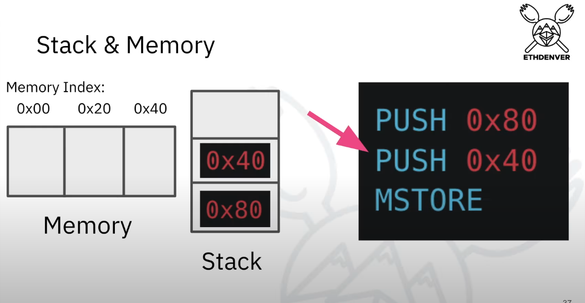
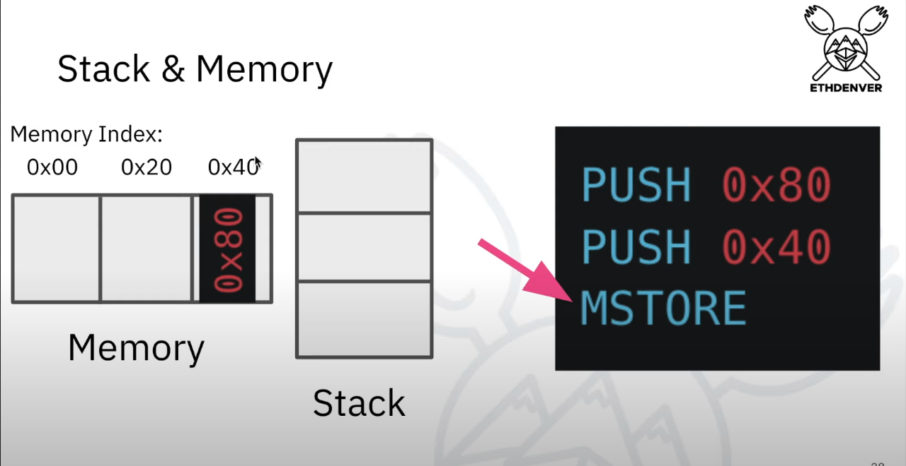

- 0x40 is always a reserved slot in memory for free memory pointer

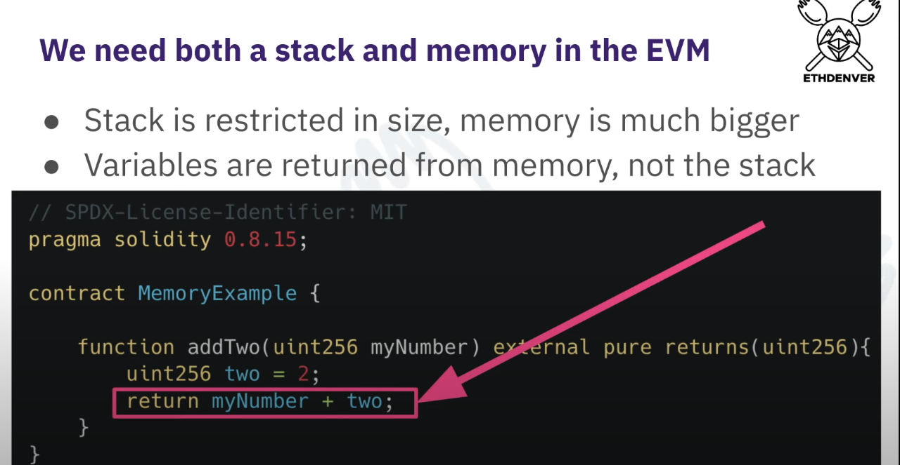
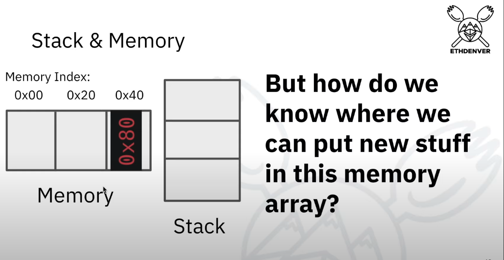

- Next time when we want to place something in memory how do we know which slot is empty?
- We need to keep track of what hasn't taken up in memory

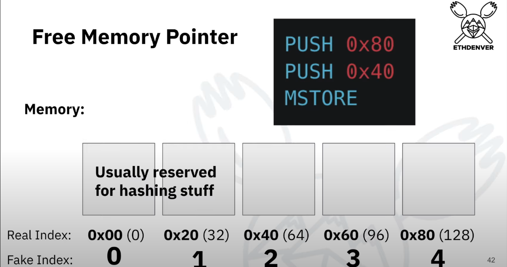

- 0x20 and 0x40 which is the 0th & 1st slot is reserved for hashing stuff
- Solidity compiler never puts anything in these 2 slots

- 0x80 is placed in `0x40`
- 0x40 points to `0x80`
- `0x40` is known as the free memory pointer
- whatever is inside `0x40` is the index that quote free memory

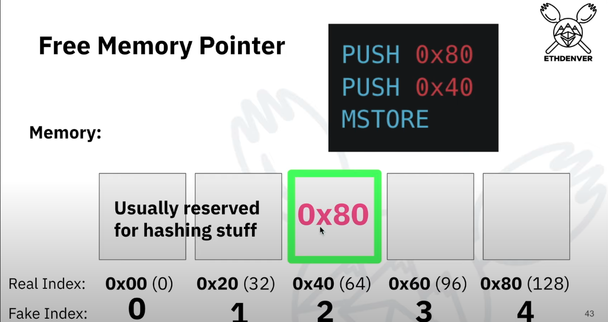
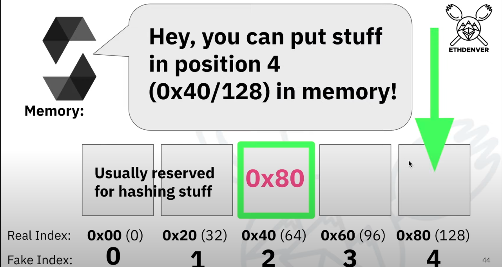

- Now whenever solidity wants to place anything in memory it will refer to the 2nd slot(0x40)
- Only solidity has free memory pointer
  
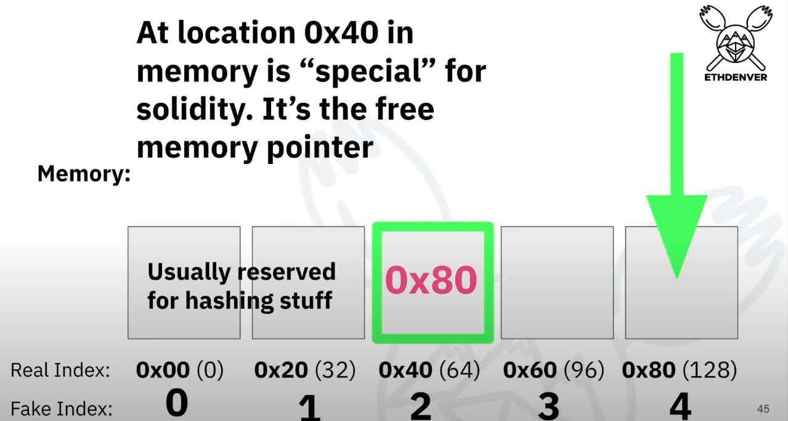

- Let's see an example

- PUSH 0X2
- PUSH 0X40
- MLOAD
- MSTORE

- [0x40, 0x2] -> 0x40 is at the top
- MLOAD -> check what's at free memory pointer location (0x40)
- if `0x80` present at `0x40` then value will be stored in `0x80`
- MSTORE -> store value in `0x80`

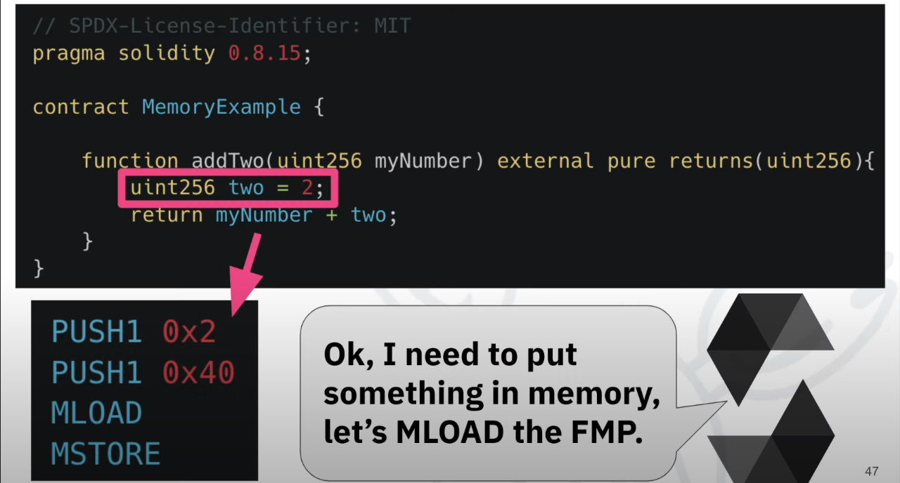
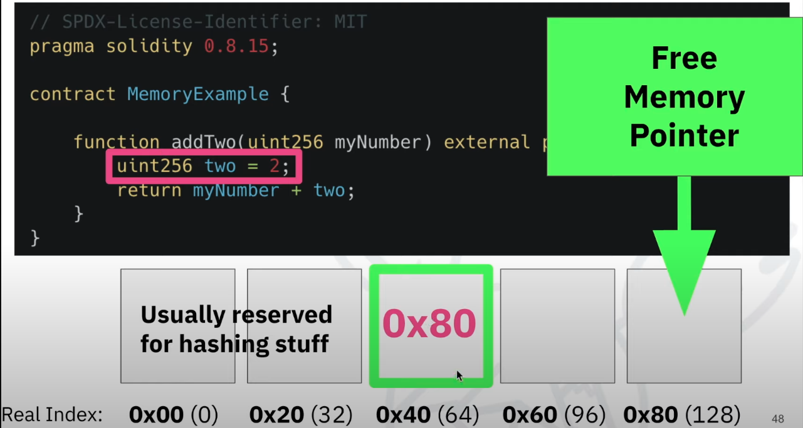
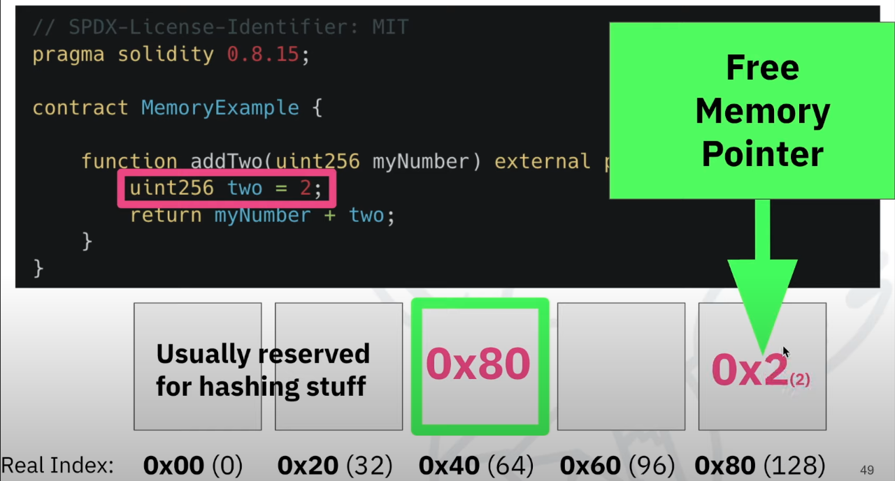

- Since `0x80` is occupied, 
- Free memory pointer will point to next slot
- `0x40` will contain `0x6a`

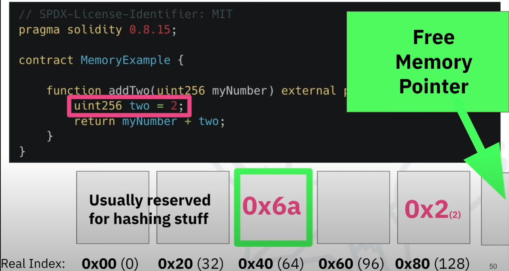

- Next time when solidity wants to store something in memory
- It will check for `0x40`
- `0x40` will contain `0x6a`
- value will be stored in `0x6a`